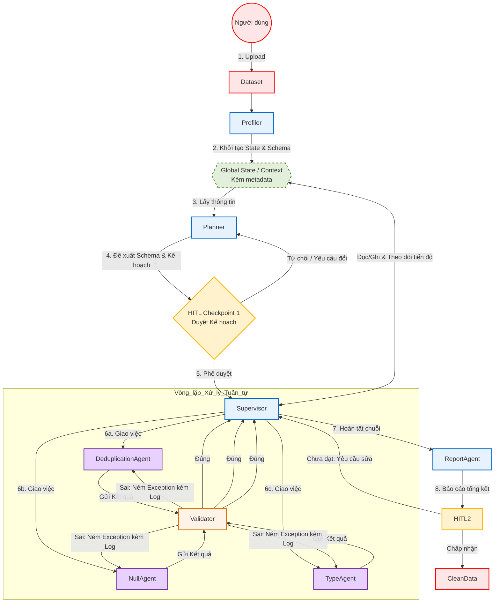

# Thiết kế kiến trúc hệ thống chi tiết với các input, output và mô tả rõ ràng.

## Chi tiết mô tả từng tác nhân trong hệ thống

- Xem ảnh 28-05-Architecture.png
## Luồng hoạt động tuần tự

Dataset → Profiler → Input Validator → Planner → HITL checkpoint 1 → Supervisor → DedupAgent → Validator → Null Agent → Validator → Type Agent → Validator → Supervisor → Report Agent → HITL checkpoint 2 → Output Clean Data. Phần Global State sẽ bọc toàn bộ

- Dùng tuần tự đặc biệt ở đoạn: Khử trùng lặp → Xử lý Null → Ép kiểu (Type Casting) để tránh lỗi ngoại lệ khi thực thi.
  - Dedup Agent, Null Agent và Type Agent sau khi xử lý đều phải thông qua Validator. "Pass" thì mới được xem là hoàn thành.
- Input dữ liệu ở các Worker Agent: Truyền schema của data file vào để xử lý chứ không bắt đọc hết. Tránh việc cháy token và đụng trần limitation
- Input Validator agent: Nhận kết quả từ Data Profiler và Requirement markdown, agent này so khớp xem yêu cầu của người dùng có thể thực hiện được không căn cứ theo metadata rút ra từ Data Profiler. Nếu yêu cầu thực hiện được thì truyền kết quả Profiler và Requirement Markdown cho Planner Agent. Trường hợp yêu cầu không thể thực hiện được (ví dụ: Kêu xử lý null trên cột A nhưng Profiler xét thấy cột A không có Null) thì gọi HITL để yêu cầu người dùng modify requirement kèm lý do tại sao requirement cũ không thực hiện được
- Planner agent: đọc kết quả từ Data Profiler Agent và sinh ra một danh sách các tác vụ có thứ tự (DAG) => Ví dụ: "Dữ liệu không có dòng nào trùng lặp, nhưng cột Age có 20% Null và định dạng Date bị sai" → bỏ qua bước deduplicator
  - Cho con Planner tự động sinh ra một mảng các bước (task_list) dựa vào phân tích dữ liệu đầu vào. Sau đó, dùng tính năng Dynamic Routing (Conditional Edges hoặc Command) của LangGraph để con Supervisor đọc cái list đó
- Deduplication Agent: Dedup theo t nghĩ thì mình có thể viết các function chuyên xử lý dedup, biến đống đó thành tool, agent lúc này sẽ nhìn vào các cột để ra quyết định rằng nên xử lý ra sao + dùng tool nào
- Validator: Cài sẵn một số hàm check, Validator sẽ đọc Plan bao gồm (requirement và các lỗi mà agent sắp sửa) để sau khi worker thực thi xong nó sẽ bốc cái hàm check phù hợp để kiểm tra. Giảm tải việc LLM đưa ra logic check
- Null Agent: Viết câu SELECT is null gì đó rồi check, sau đó hỏi người dùng muốn remove nó hay điền giá trị default là gì
- Type Agent: cho 10 example để check và làm. tuân thủ nghiêm ngặt kiểu dữ liệu, cơ bản là vì mình đang làm phần T (Transform) trong ETL, nên là tốt hơn hết thì phải tính tới việc tuân thủ đúng kiểu data type rồi nạp vào Database

Phần lưu ý:  
Giới hạn vòng lặp tự sửa lỗi (Max Retries Cap)

- Rủi ro: khi Pandera ném ra lỗi SchemaError, Worker Agent sẽ đọc log và sửa code. Nếu logic dữ liệu thô có sự bất thường mà Worker không xử lý nổi, Agent có thể bị rơi vào vòng lặp vô hạn.
- Giải pháp: cấu hình cứng max_retries = 3 cho mỗi tác vụ con trong DAG. Nếu vượt quá 3 lần tự sửa không thành công, Agent phải tự động chuyển trạng thái sang "Human-in-the-loop" (Gửi cảnh báo và đợi con người can thiệp) hoặc cô lập bản ghi lỗi đó ra một vùng riêng (Queue) để xử lý sau, không làm tắc nghẽn toàn bộ luồng.

Quản lý Kích thước của Global State

- Lưu Tên cột, Kiểu dữ liệu (Dtype), state hoàn thành. Không lưu bản sao của Dataframe vật lý vào Global State của Agent; Dataframe vật lý nên được lưu ở một bộ lưu trữ dùng chung (Shared Storage / Memory Object Reference) và các Agent chỉ truyền nhau con trỏ hoặc đường dẫn (Path) để truy cập.

Tech stack:

Python, Langgraph, Pandas, Pandera, Postgres, Redis

