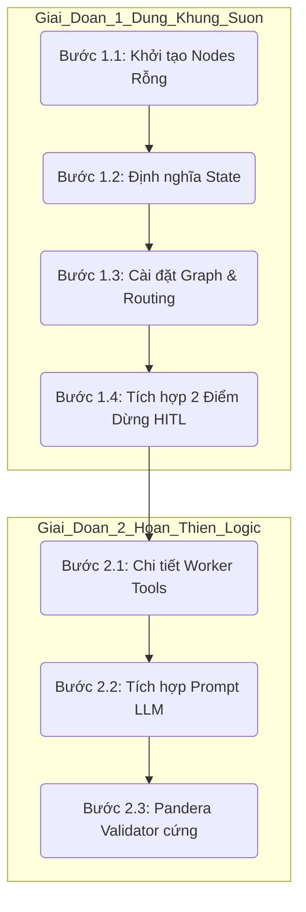

# Kế hoạch Triển khai Chi tiết: Áp dụng Kiến trúc Hệ thống Multi-Agent LangGraph

Tài liệu này vạch ra lộ trình triển khai hai giai đoạn, **ưu tiên hàng đầu vào việc dựng vững chắc khung sườn kiến trúc (Skeletal Flow)** ở Giai đoạn 1 để đảm bảo luồng chạy thông suốt trước khi đi sâu vào chi tiết logic của từng Agent ở Giai đoạn 2.

---

## 🗺️ Bản đồ Lộ trình 2 Giai đoạn



---

## 🏛️ GIAI ĐOẠN 1: DỰNG ĐÚNG & ĐỦ KHUNG SƯỜN KIẾN TRÚC (ƯU TIÊN HÀNG ĐẦU)

Mục tiêu của giai đoạn này là khởi tạo tất cả các Node, Cạnh (Edges), Trạng thái (State), và các điểm dừng tương tác người dùng (HITL) dưới dạng **Mock/Stub (Khung rỗng)**. Đảm bảo hệ thống có thể kích hoạt, định tuyến tuần tự và chạy thử nghiệm thông suốt từ đầu đến cuối mà chưa cần hoàn thiện prompt hay cài đặt LLM phức tạp.

### 🟢 Bước 1.1: Khởi tạo Stub Nodes (Node rỗng) cho tất cả các tác nhân
Tạo các node giả lập để khớp đúng sơ đồ kiến trúc mà không bị lỗi thiếu import.

*   **Tệp cần tạo**: `app/graphs/nodes/stubs.py` (hoặc định nghĩa trực tiếp trong `app/graphs/nodes.py`)
*   **Hành động**: Định nghĩa các hàm node nhận `GlobalState` và trả về cập nhật state giả lập:
    *   `planner_node`: Sinh ra một `task_list` mặc định (e.g., `["deduplication", "null_handling", "type_casting"]`).
    *   `supervisor_node`: Tăng chỉ số `current_task_idx` và chuyển tiếp nhiệm vụ.
    *   `dedup_agent_node`, `null_agent_node`, `type_agent_node`: Các worker stub in ra logs `"Agent đang xử lý..."` và đánh dấu hoàn thành bước.
    *   `validator_node`: Giả lập kiểm tra luôn đạt (Pass) ở lần đầu tiên.
    *   `report_agent_node`: Trả về kết quả tổng kết mẫu.

---

### 🟢 Bước 1.2: Chuẩn hóa Global State điều phối
Xây dựng khung lưu trữ thông tin điều hướng của Graph.

*   **Tệp cần sửa**: `app/graphs/states/graph_state.py`
*   **Hành động**: Khai báo chính xác các trường dữ liệu để Supervisor và Validator phối hợp:
    ```python
    class GlobalState(TypedDict):
        # Trạng thái điều phối DAG
        task_list: List[str]          # Danh sách tác vụ động: ["deduplication", ...]
        current_task_idx: int         # Vị trí tác vụ hiện tại trong task_list
        retry_count: int              # Đếm số lần tự sửa lỗi hiện tại
        
        # Quản lý đường dẫn vật lý (Không lưu trực tiếp Dataframe thô vào State)
        physical_dataframe_path: str  # Đường dẫn tệp Parquet trung gian
        
        # Các thông tin metadata khác
        user_prompt: str
        data_profile: dict
        validation_result: dict
        completed_steps: List[str]
        global_errors: List[str]
    ```

---

### 🟢 Bước 1.3: Cài đặt Graph & Dynamic Routing
Lắp ráp tất cả các Stub Nodes vào cấu trúc `StateGraph` và thiết lập cạnh điều kiện.

*   **Tệp cần sửa**: `app/graphs/graph.py`
*   **Hành động**:
    1.  Đăng ký đầy đủ các Node vào builder: `builder.add_node("supervisor", supervisor_node)`, v.v.
    2.  Thiết lập **Conditional Edge** tại `Supervisor` dựa trên `task_list[current_task_idx]`:
        *   Nếu giá trị là `"deduplication"` $\rightarrow$ chuyển hướng tới `dedup_agent`.
        *   Nếu giá trị là `"null_handling"` $\rightarrow$ chuyển hướng tới `null_agent`.
        *   Nếu giá trị là `"type_casting"` $\rightarrow$ chuyển hướng tới `type_agent`.
        *   Nếu hết danh sách $\rightarrow$ chuyển hướng tới `report_agent`.
    3.  Thiết lập **Validator Routing**: Node Validator kiểm tra, nếu đạt chuyển về `supervisor`, nếu lỗi chuyển về worker tương ứng để sửa lỗi.

---

### 🟢 Bước 1.4: Tích hợp 2 Điểm dừng Human-In-The-Loop (HITL)
Đảm bảo khung kiến trúc hỗ trợ ngắt tiến trình để chờ người dùng tương tác mà không bị crash luồng.

*   **Tệp cần sửa**: `app/graphs/graph.py`
*   **Hành động**:
    1.  **HITL Checkpoint 1 (Duyệt Kế hoạch)**: Sử dụng cơ chế đầu vào tương tác `interrupt()` của LangGraph ngay sau khi `planner_node` đề xuất kế hoạch. Luồng sẽ dừng lại và đợi UI gửi tín hiệu Approve/Modify.
    2.  **HITL Checkpoint 2 (Nghiệm thu báo cáo)**: Đặt `interrupt()` sau `report_agent_node` để người dùng xác nhận tải xuống hoặc yêu cầu xử lý lại.

---

## 🛠️ GIAI ĐOẠN 2: HOÀN THIỆN CHI TIẾT LOGIC AGENT & TOOLS

Sau khi khung sườn ở Giai đoạn 1 đã chạy thử nghiệm thông suốt (end-to-end), tiến hành đắp thịt (implement logic chi tiết) cho từng Agent.

### 🟡 Bước 2.1: Triển khai các Worker Tools bằng Pandas
Viết các hàm thư viện Pandas chuyên dụng để thao tác trực tiếp trên dữ liệu vật lý (tải qua `physical_dataframe_path`).
*   **Deduplication Tools**: Các hàm drop trùng lặp, giữ dòng đầu/cuối.
*   **Null Tools**: Các thuật toán điền khuyết (mean, median, ffill, constant).
*   **Type Casting Tools**: Các hàm chuyển đổi định dạng ngày tháng, số nguyên, chuỗi.

### 🟡 Bước 2.2: Tích hợp Prompt LLM cho Agent
Cấu hình LangChain chat model với các system prompt chuyên biệt để:
*   Đọc metadata từ `data_profile` và đưa ra quyết định chọn tham số cho các Tool Pandas.
*   Tự động đọc mã lỗi từ Validator ném ra để tự sửa đổi các tham số đầu vào (tối đa 3 lần).

### 🟡 Bước 2.3: Xây dựng Pandera Validator cứng
*   Cấu hình các bộ schema Pandera tương ứng với từng tác vụ làm sạch để bắt lỗi kiểu dữ liệu và null một cách triệt để, ném ngoại lệ rõ ràng kèm log để Agent tự sửa.
