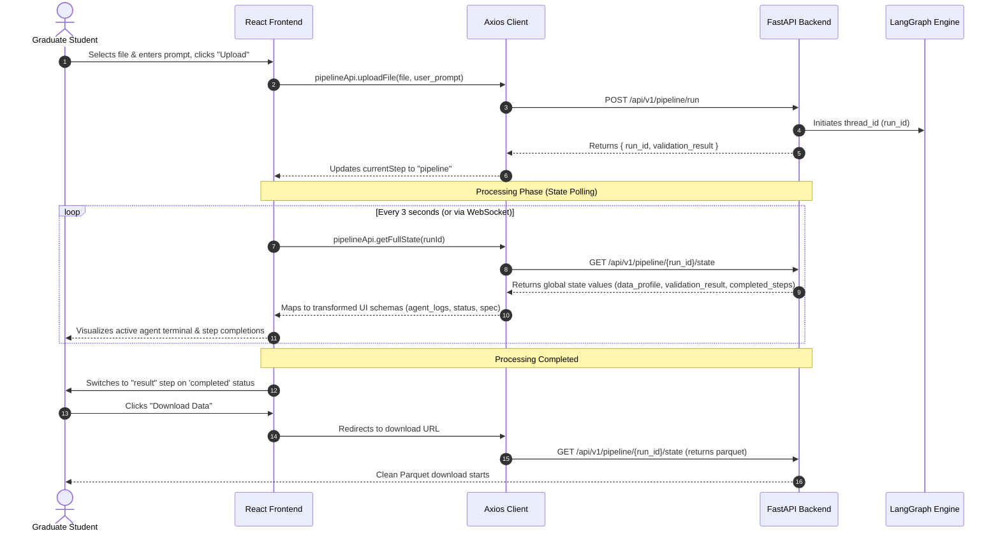

# Frontend Architecture & Backend API Alignment Plan

This document details the architectural structure, API mappings, data flow models, and optimization strategies for the **Agentic Data Cleaner** frontend system, ensuring it integrates with the LangGraph-based backend.

---

## 1. Proposed Frontend Structure

The frontend is structured as a modern React + TypeScript application powered by Vite, TailwindCSS, and ShadCN UI components:

```
frontend/
├── src/
│   ├── api/
│   │   ├── client.ts         # Axios client config (baseURL set to /api/v1)
│   │   └── services.ts       # API service functions & TypeScript models (Aligned)
│   ├── components/
│   │   ├── layout/
│   │   │   └── Header.tsx    # Header & Step navigation bar
│   │   └── views/
│   │       ├── UploadView.tsx              # Dataset Upload & Profiling Screen
│   │       ├── PipelineView.tsx            # Multi-agent Pipeline Logs & Progress
│   │       ├── PipelineHitlPanel.tsx       # Human-In-The-Loop review (Modular)
│   │       ├── RequirementSummaryPanel.tsx # LLM summary interpretation
│   │       └── ResultView.tsx              # Final clean report & download
│   ├── lib/
│   │   └── pipelineSession.ts # URL state serialization & route management
│   ├── App.tsx               # Main SPA Router & Coordinator
│   └── main.tsx              # Vite app entry point
```

---

## 2. UI Screen to Backend API Mappings

| UI Screen | User Action | Backend Endpoint | Request Payload | Response / Impact |
| :--- | :--- | :--- | :--- | :--- |
| **Upload View** | Drag/Drop & Submit dataset | `POST /api/v1/pipeline/run` | `file` (Multipart), `user_prompt` (Form Data) | Starts LangGraph execution; returns `run_id` and initial validation. |
| **Upload View** | Load Profile details | `GET /api/v1/pipeline/{run_id}/state` | `run_id` (Path parameter) | Fetches completed profiling state & detailed numeric histograms. |
| **Pipeline View** | Monitor live progress / logs | `GET /api/v1/pipeline/{run_id}/state` | `run_id` (Path parameter) | Polls the latest graph checkpoint to extract `completed_steps` and `errors`. |
| **Result View** | Review data metrics & issues | `GET /api/v1/pipeline/{run_id}/state` | `run_id` (Path parameter) | Renders token usage stats, data quality metrics, and validation reports. |
| **Result View** | Download Parquet file | `GET /api/v1/pipeline/{run_id}/state` | `run_id` (Path parameter) | Downloads the clean canonical data file. |

---

## 3. Data Flow: UI $\rightarrow$ API $\rightarrow$ UI



---

## 4. Software Architecture & Optimization Thinking

### 🚀 Performance Optimization
- **Lazy Loading Components**: Utilizing React `Suspense` and `lazy` imports for heavy panels (like Excel parser sheets and JSON renderers) ensures faster Initial Page Load times.
- **Smart React Query Caching**: Configured `@tanstack/react-query` to automatically suspend polling when a pipeline is in terminal states (`completed` or `failed`) to save server bandwidth.

### 🎨 User Experience (UX)
- **State Serialization**: Saves current state to URL parameters (`?step=...&runId=...`). When refreshing, the user does not lose their progress during a long ETL execution.
- **Dynamic Graphical Profiles**: Replaces boring textual tables with detailed interactive SVG histograms for numeric fields and relative bar charts for categories.

### 🔒 Robust Clean Code & Architecture
- **API Mapping Layer**: The Axios service acts as an abstraction model translating graph state outputs into components expectations. This isolates UI files from potential backend schema changes.
- **Micro-Animations**: Uses subtle fade-in transitions and loaders to provide reassurance while LLM operations are executing in the background.
