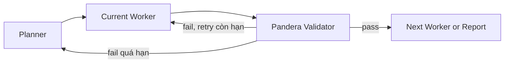
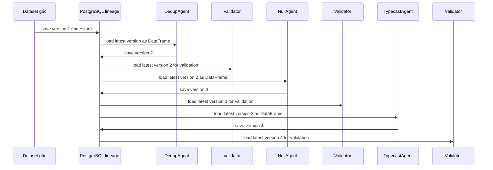

# Pandera Validator Implementation Summary

**Update time:** Friday Jun 5, 2026, 7:57 PM (UTC+7)

## 0. Cập nhật mới nhất: áp dụng PostgreSQL lineage vào code

Sau khi rà lại flow lưu data version hiện tại, phần runtime đã được cập nhật để DataFrame sau worker được xác định bằng **latest data version trong PostgreSQL lineage store**.

Flow chuẩn trong code sau cập nhật:

```text
dataset gốc
  -> ingestion save PostgreSQL version 1
  -> worker load latest version thành pandas DataFrame
  -> worker xử lý
  -> worker save DataFrame kết quả thành PostgreSQL version mới
  -> validator load latest version vừa được lưu
  -> Pandera validate DataFrame đó
```

Các thay đổi đã áp dụng vào code:

| File | Thay đổi |
| --- | --- |
| `app/services/lineage_utils.py` | Thêm helper `resolve_lineage_session_id(...)` và `parse_uuid(...)` để dùng chung khi cần lấy session UUID từ state. |
| `app/validators/runner.py` | Validator ưu tiên `LineageService.get_latest_version(session_id)`; file path chỉ còn fallback cho local/dev. |
| `app/graphs/nodes.py` | Worker stubs (`dedup_agent_node`, `null_agent_node`, `type_agent_node`) giờ load latest DataFrame từ lineage store và append version mới dạng pass-through. |
| `app/services/lineage_service.py` | `append_new_version(...)` normalize `NaN/NaT` thành `None` trước khi lưu JSONB. |
| `app/graphs/states/global_state.py` | Thêm `session_id` vào `GlobalState`. |
| `app/services/pipeline.py` | Set `session_id = Path(canonical_path).stem` khi khởi tạo state. |

Kết luận sau cập nhật: **DataFrame chuẩn để Validator kiểm tra là latest version trong PostgreSQL lineage store**, không phải DataFrame trong memory và không phải file parquet trung gian.

## 1. Validator hiện đã làm gì

Validator hiện được cài như một cổng kiểm định deterministic sau mỗi worker trong pipeline cleaning:




Các phần đã được thêm/cập nhật:


| Khu vực           | File                                | Nội dung                                                                                                     |
| ----------------- | ----------------------------------- | ------------------------------------------------------------------------------------------------------------ |
| Dependency        | `pyproject.toml`                    | Thêm `pandera[pandas]` cho validation trên pandas DataFrame.                                                 |
| Validator package | `app/validators/`                   | Tạo module riêng cho validator deterministic, tách khỏi LLM agent.                                           |
| Schema builder    | `app/validators/schema_builder.py`  | Build `pa.DataFrameSchema` từ `ExecutionPlan.work_order`, `strategy`, `verification`, và `semantic_profile`. |
| Runner            | `app/validators/runner.py`          | Resolve active task, load latest DataFrame từ PostgreSQL lineage, chạy `schema.validate(df, lazy=True)`, chuẩn hóa lỗi. |
| Outcome model     | `app/validators/models.py`          | Chuẩn hóa kết quả pass/fail/skipped/failure cases.                                                           |
| Graph node        | `app/graphs/nodes.py`               | `validator_node` gọi Pandera runner thật thay vì luôn PASS.                                                  |
| Graph routing     | `app/graphs/graph.py`               | `planner -> worker -> validator -> worker/report/planner`.                                                   |
| Global state      | `app/graphs/states/global_state.py` | Thêm field phục vụ retry, replan và lineage: `task_list`, `session_id`, `last_validation_error`, `failed_task_id`, `replan_reason`. |


## 2. Validator validate bằng dữ liệu nào

Pandera chỉ cần hai input runtime chính:

1. **DataFrame thực tế sau worker**
  - Nguồn chuẩn là latest data version trong PostgreSQL lineage store.
  - Worker load DataFrame gần nhất từ database, xử lý, rồi lưu kết quả thành version mới.
  - Validator sau worker gọi `LineageService.get_latest_version(session_id)` để lấy đúng version mới nhất vừa được worker ghi.
  - File path như `physical_dataframe_path`, `dataset_version`, `current_dataset_version`, hoặc `dataset_path` chỉ là fallback cho dev/test hoặc giai đoạn chưa có lineage version.
2. **Pandera schema**
  - Không được Planner viết trực tiếp bằng code.
  - Được build động trong `schema_builder.py` từ:
    - `execution_plan.task_list[].work_order`
    - `work_order.strategy`
    - `work_order.verification.pandera_checks`
    - `semantic_profile`
    - rule mapping cố định trong code

Điểm quan trọng: Planner chỉ mô tả ý định và tham số. Validator code mới là nơi chuyển ý định đó thành `DataFrameSchema`, `Column`, và `Check`.

### 2.1 Cách xác định DataFrame sau worker chuẩn hơn

Flow dữ liệu hiện tại:



Vì vậy, trong production flow, "DataFrame sau worker" là:

```text
latest DataFrame reconstructed from dataset_records
where session_id = current session
and version = max(lineage_versions.version)
```

Implementation trong `app/validators/runner.py` hiện chạy theo thứ tự:

1. Resolve `session_id` từ state bằng `resolve_lineage_session_id(...)`.
2. Gọi `LineageService.get_latest_version(session_id)`.
3. Nếu có DataFrame từ DB, validate DataFrame đó.
4. Nếu chưa có lineage data, fallback sang file path để giữ khả năng chạy local/dev.

Worker stubs hiện cũng đã áp dụng contract này: load latest DataFrame, append version mới dạng pass-through, rồi trả `dataset_version` / `current_dataset_version` mới vào state. Khi worker thật hoàn thiện, phần pass-through sẽ được thay bằng transform thật.

## 3. Các rule hiện đã hỗ trợ

### Deduplication

Nguồn từ plan:

- `strategy.primary_keys`
- `verification.pandera_checks`
- `verification.success_metrics`

Mapping hiện tại:


| Plan                                 | Pandera / logic                       |
| ------------------------------------ | ------------------------------------- |
| `primary_keys`                       | `DataFrameSchema(unique=[...])`       |
| `is_unique:<col>`                    | `Column(unique=True)`                 |
| `no_duplicate_rows`                  | DataFrame-level `Check`               |
| `success_metrics.duplicate_rows = 0` | DataFrame-level duplicate count check |


### Null Handling

Nguồn từ plan:

- `strategy.per_column`
- `verification.pandera_checks`
- `semantic_profile.columns[*].allow_missing`
- `semantic_profile.columns[*].potential_dmv`

Mapping hiện tại:


| Plan / semantic                                                   | Pandera / logic                                                                         |
| ----------------------------------------------------------------- | --------------------------------------------------------------------------------------- |
| `fill_mean`, `fill_median`, `fill_mode`, `fill_value`, `drop_row` | `nullable=False` sau khi worker xử lý                                                   |
| `null_rate_lt:<col>:<threshold>`                                  | Column-level null-rate check, hiện dùng `<= threshold` để `0.0` nghĩa là không còn null |
| `potential_dmv`                                                   | `Check.notin(...)` để chặn disguised missing values còn sót                             |
| `allow_missing`                                                   | Default `nullable` nếu không có strategy override                                       |


### Type Casting

Nguồn từ plan:

- `strategy.per_column.<col>.expected_type`
- `semantic_profile.columns[*].expected_type`
- `semantic_profile.columns[*].expected_str_pattern`

Mapping hiện tại:


| Expected type      | Pandera dtype |
| ------------------ | ------------- |
| `int`, `integer`   | `int`         |
| `float`, `number`  | `float`       |
| `str`, `string`    | `str`         |
| `bool`, `boolean`  | `bool`        |
| `date`, `datetime` | `pa.DateTime` |


Nếu semantic profile có `expected_str_pattern`, builder thêm `Check.str_matches(...)`.

## 4. Cách retry và replan đang hoạt động

`validator_node` nhận `ValidationOutcome` từ runner:


| Kết quả                                    | Hành động                                                                                                  |
| ------------------------------------------ | ---------------------------------------------------------------------------------------------------------- |
| `passed=True`                              | Tăng `current_task_idx`, reset `retry_count`, route sang worker kế tiếp hoặc report.                       |
| `passed=True`, `skipped=True`              | Coi như pass vì task trong plan được skip.                                                                 |
| `passed=False`, retry còn hạn              | Giữ nguyên `current_task_idx`, tăng `retry_count`, ghi `last_validation_error`, route lại worker hiện tại. |
| `passed=False`, quá `max_retries_per_task` | Ghi `failed_task_id`, `replan_reason`, `global_errors`, route lại Planner.                                 |


Lỗi Pandera được normalize thành:

- `failed_rules`
- `message`
- `failure_cases`
- `last_validation_error`

Worker agents sau này có thể đọc `last_validation_error` để tự sửa tham số hoặc logic xử lý.

## 5. Tính hợp lý của thiết kế

### 5.1 Tách Planner intent khỏi validation code

Planner là LLM, nên phù hợp để quyết định:

- cần xử lý cột nào
- strategy nào hợp lý
- khóa dedup là gì
- expected type là gì
- rule nào cần verify

Nhưng Planner không nên sinh code Pandera trực tiếp. Code validation phải deterministic để tránh lỗi format, hallucination, hoặc rule không chạy được.

Vì vậy thiết kế hiện tại dùng:

```text
Planner JSON -> schema_builder.py -> Pandera DataFrameSchema -> validate(df)
```

### 5.2 Validator nằm sau worker là đúng vai trò

Pandera không thay thế worker. Pandera chỉ trả lời câu hỏi:

> Sau khi worker xử lý xong, dữ liệu có đạt contract chưa?

Điều này hợp với ba worker:

- Dedup worker làm transformation; Validator kiểm unique/no duplicate.
- Null worker fill/drop/null normalize; Validator kiểm nullable/null_rate/DMV.
- Type worker cast dữ liệu; Validator kiểm dtype/regex/date parse result.

### 5.3 Không lưu DataFrame trong GlobalState

State chỉ giữ identifier/version metadata. Validator tự reconstruct DataFrame từ PostgreSQL lineage store. Cách này hợp lý vì:

- tránh nhúng dữ liệu lớn vào LangGraph state
- tránh token/RAM tăng không cần thiết
- dễ audit lineage theo `session_id`, `version`, `agent_name`, `description`
- worker và validator có contract rõ ràng qua PostgreSQL data version

### 5.4 Graph routing trực tiếp đơn giản hơn

Flow hiện tại dùng `current_task_idx` và `task_list` để route trực tiếp:

```text
planner -> current worker -> validator -> next worker/report
```

Validator là nơi quyết định pass/retry/replan. Như vậy không cần thêm một node điều phối trung gian chỉ để đọc index và chuyển tiếp.

### 5.5 `lazy=True` phù hợp cho worker tự sửa

Pandera `validate(..., lazy=True)` gom nhiều lỗi trong một lần validate. Worker sau này nhận được bức tranh đầy đủ hơn:

- lỗi cột nào
- check nào fail
- failure case nào
- có bao nhiêu nhóm lỗi

Điều này tốt hơn fail-fast vì worker không phải sửa từng lỗi một rồi chạy lại nhiều vòng.

## 6. Giới hạn hiện tại

Validator hiện là foundation, chưa phải bản production hoàn chỉnh.

Các giới hạn chính:

1. Worker agents vẫn là stub, nên fail validation hiện tại có thể loop retry rồi replan vì chưa có worker thật để sửa data.
2. `pandera_checks` mới hỗ trợ một số DSL cơ bản: `is_unique`, `null_rate_lt`, `null_rate_lte`, `no_duplicate_rows`.
3. `strict=False`, vì worker chưa ổn định contract cột output. Sau này có thể bật strict theo task.
4. Chưa có test runtime vì dependency/runtime shell chưa xác nhận được trong phiên vừa rồi.
5. Chưa cập nhật lockfile vì repo hiện không có `uv.lock` hoặc lockfile tương ứng.
6. Error log hiện compact dưới dạng string; sau này nên nâng thành model có cấu trúc nếu worker cần parse kỹ.

## 7. Việc cần làm sau khi hoàn thiện worker agents

### 7.1 Chuẩn hóa contract worker input/output

Mỗi worker cần đọc đúng active work order:

```text
execution_plan.task_list[current_task_idx].work_order
```

Và cần dùng lineage store làm nguồn dữ liệu chính:

- Load input bằng `LineageService.get_latest_version(session_id)`.
- Sau khi xử lý xong, lưu output bằng `LineageService.append_new_version(session_id, df, agent_name, description)`.
- Cập nhật state nếu cần với version mới nhất, nhưng không nhúng DataFrame vào state.

File path chỉ nên giữ vai trò fallback hoặc artifact xuất/nhập, không phải contract chính giữa worker và Validator.

### 7.2 Worker phải đọc `last_validation_error` khi retry

Khi Validator fail nhưng chưa quá retry, worker được gọi lại với cùng `current_task_idx`.

Worker cần dùng:

- `last_validation_error`
- `failed_task_id`
- `retry_count`
- `execution_plan`

để điều chỉnh cách xử lý.

Ví dụ:

- Dedup fail unique key: đổi subset hoặc drop duplicate lại.
- Null fail DMV: convert thêm disguised missing values rồi fill/drop.
- Type fail dtype: dùng parse/coerce logic mạnh hơn hoặc fallback safe cast.

### 7.3 Tạo test fixture cho từng task

Cần thêm test tối thiểu:


| Test         | Mục tiêu                               |
| ------------ | -------------------------------------- |
| Dedup pass   | DataFrame không trùng PK validate pass |
| Dedup fail   | Trùng PK trả `failure_cases`           |
| Null pass    | Fill xong không còn null/DMV           |
| Null fail    | Còn null hoặc DMV bị bắt               |
| Type pass    | Cast đúng dtype                        |
| Type fail    | Sai dtype hoặc pattern fail            |
| Retry route  | Fail dưới max retry route lại worker   |
| Replan route | Fail quá max retry route Planner       |


### 7.4 Mở rộng DSL `pandera_checks`

Sau worker thật, nên bổ sung các rule thường gặp:

- `row_count_preserved`
- `row_count_lte_baseline`
- `column_exists`
- `column_not_exists`
- `dtype_matches`
- `regex_matches`
- `value_notin`
- `value_in_range`
- `date_parseable`
- `non_negative`
- `unique_composite:<col1>,<col2>`

### 7.5 Quyết định strictness theo task

Hiện `strict=False` để không chặn cột ngoài ý muốn trong giai đoạn worker chưa hoàn thiện.

Sau khi worker ổn định:

- Dedup: thường `strict=False` hoặc preserve schema.
- Null: nên preserve column set.
- Type: có thể `strict=True` nếu output contract cố định.

### 7.6 Hoàn thiện lineage/versioning

Worker nên ghi version mới sau mỗi transform bằng `LineageService.append_new_version`:

```text
raw -> dedup_v1 -> null_v1 -> type_v1
```

Validator nên validate đúng version mới nhất và ghi validation result gắn với `session_id` + `version` đó.

### 7.7 Tích hợp report cuối

`report_agent` nên đọc:

- `validation_results`
- `worker_states`
- `last_validation_error`
- dataset lineage/version
- số retry từng task

để tạo báo cáo cuối: task nào pass, task nào skip, rule nào fail rồi đã sửa, dữ liệu cuối nằm ở `session_id` và version nào.

### 7.8 Chạy runtime verification

Sau khi install dependency đầy đủ:

```bash
python -m compileall app
python -c "from app.graphs.graph import build_graph; build_graph(); print('graph ok')"
```

Sau đó chạy một pipeline nhỏ bằng CSV fixture để xác nhận:

```text
Profiler -> Semantic Profile -> Input Validator -> Planner -> Worker -> Validator -> Report
```

## 8. Kết luận

Validator hiện đã đặt được contract chính:

```text
worker saves new PostgreSQL data version -> validator loads latest version -> builds Pandera schema from plan -> validates lazily -> pass/retry/replan
```

Thiết kế này hợp lý vì giữ LLM ở vai trò lập kế hoạch và sửa lỗi, còn validation thực tế do code deterministic đảm nhiệm. Sau khi các worker agents hoàn thiện, phần quan trọng nhất là làm cho worker đọc `work_order`, load/save đúng PostgreSQL data version qua `LineageService`, và dùng `last_validation_error` để self-correct trong giới hạn retry.